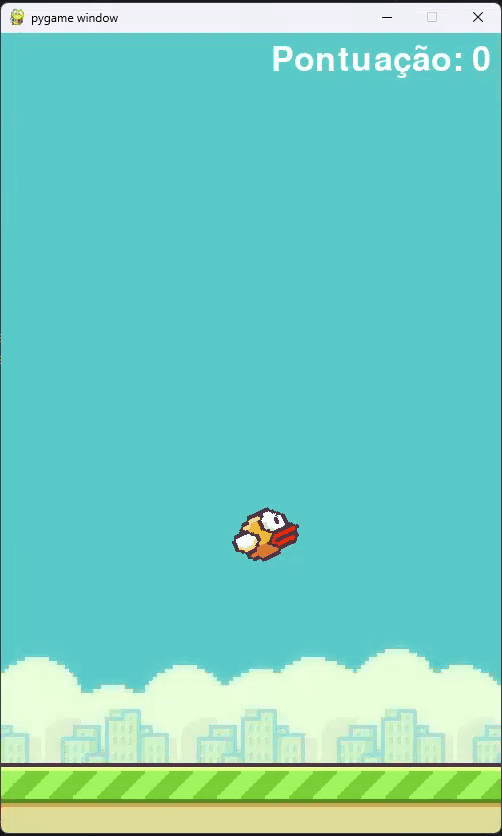

# 🐦 Flappy Bird em Python


Este projeto é uma recriação do clássico jogo **Flappy Bird**, desenvolvido em **Python** utilizando a biblioteca **pygame**. O objetivo é controlar o pássaro e desviar dos canos, acumulando a maior pontuação possível.


## 🎥 Demonstração



---

## 🎮 Como jogar

- Pressione a **barra de espaço** (`SPACE`) para fazer o pássaro voar.
- Evite colidir com os canos ou com o chão.
- Cada par de canos ultrapassado soma 1 ponto.

---

## 🛠️ Tecnologias usadas

- [Python 3.x](https://www.python.org/)
- [Pygame](https://www.pygame.org/news)

---


## 📦 Instalação

1. **Clone o repositório**:
   ```bash
   git clone https://github.com/Henrique-Capitani/FlappyBird.git
   cd FlappyBird
